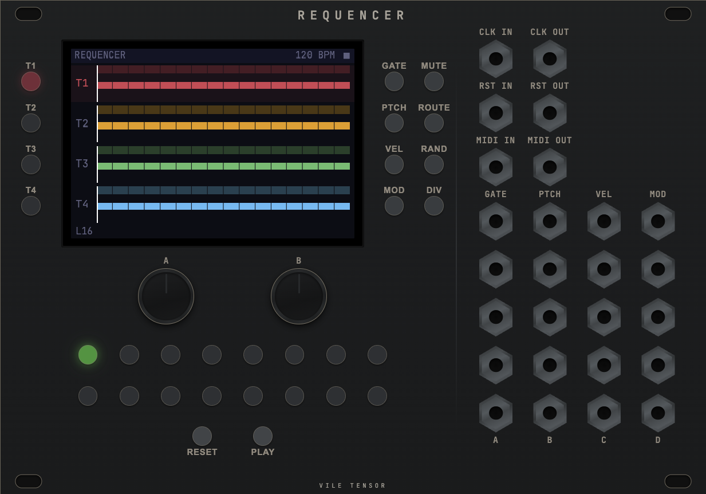

# Requencer

A 4-track eurorack-style step sequencer prototype running in the browser. Each track has independent gate, pitch, velocity and mod subtracks with per-subtrack length and clock dividers. Outputs are freely routable, and a built-in randomizer generates musically useful patterns using euclidean rhythms and scale-quantized pitch.

[Try it live](https://devboy.github.io/requencer/)

