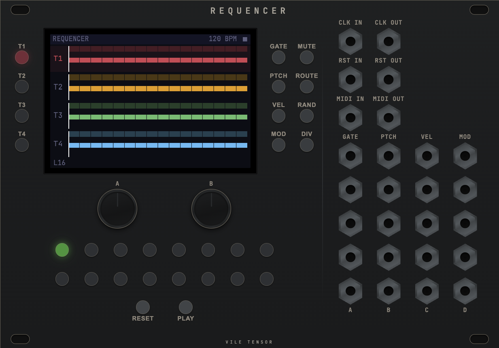

# Requencer

A 4-track eurorack-style step sequencer prototype running in the browser. Each track has independent gate, pitch, velocity and mod subtracks with per-subtrack length and clock dividers. Outputs are freely routable, and a built-in randomizer generates musically useful patterns using four gate algorithms (RAND, EUCL, SYNC, CLST) and scale-quantized pitch.

This prototype is based on a live performance setup that currently uses 4 separate sequencers and several utility modules to achieve polymetric, randomized sequences across multiple voices. The goal is to combine all of that into a single, hands-on eurorack module.

[Try it live](https://devboy.github.io/requencer/)

## Controls

Keyboard-driven with eurorack-style hold combos. Hold a track button (1–4) + encoder arrows to edit length and clock dividers. Hold a track or subtrack button + D to randomize that layer. Hold + Backspace to reset playheads. Double-tap any holdable button to lock it in "sticky hold" — interact one-handed, then tap again or press Escape to release. Press `?` for the full keymap.

| Key | Function |
|-----|----------|
| 1–4 | Select track T1–T4 |
| Q/W/E/R | Gate / Pitch / Velocity / Mod edit |
| A | Mute patterns |
| S | Route outputs |
| D | Randomizer |
| F | Drift (mutate) |
| G | Transpose |
| Z–, / Shift+Z–, | Step buttons 1–8 / 9–16 |
| Arrow Up/Down | Encoder A (scroll / value) |
| Arrow Left/Right | Encoder B (page / adjust) |
| Enter | Encoder A push (hold = reset) |
| Space | Play / Stop |
| Backspace | Reset playheads |
| Escape | Back to home |
| ? | Keyboard shortcut reference |

## Tracks & Subtracks

4 tracks, each with 4 independent subtracks: gate (rhythm), pitch (melody), velocity (dynamics), and mod (modulation). Every subtrack has its own step length (1–64) and clock divider, so a track can run a 7-step gate pattern at ÷2 alongside a 12-step pitch sequence at ÷1 — creating evolving polymetric patterns.

## Randomizer

Press D to open the RAND screen. Configure per-track parameters: musical scale & root, pitch range, max distinct notes, fill density (min/max %), velocity range, and gate mode. Four gate algorithms: RAND (Fisher-Yates shuffle), EUCL (Bjorklund euclidean), SYNC (offbeat-biased weighted random), CLST (Markov chain clustered bursts). Quick randomize with hold combos: Hold 1–4 + D for an entire track, Hold Q/W/E/R + D for a single subtrack layer, or Hold D alone for everything. 8 factory presets (Bassline, Hypnotic, Acid, Ambient, Percussive, Sparse, Stab, Driving) shape the randomizer — save your own from the RAND screen.

## Drift & Transpose

Press F for the DRIFT screen — per-track stochastic mutation. Each subtrack has an independent drift rate that controls how quickly steps mutate over time, creating gradual pattern evolution.

Press G for the TRANSPOSE screen — per-track transposition with semitone offset, note range, and scale quantization.

## Routing

Press S to enter the route screen. Each track's 4 subtrack outputs (gate/pitch/vel/mod) can be freely routed to any of the 4 output jacks (A–D), enabling multi-voice or layered configurations.

## Settings

Press the SET button (jack zone) to open global settings. Clock section: BPM and clock source (INT / MIDI / EXT). MIDI section: global MIDI on/off, device selection, and per-output MIDI channel assignment (1–16).
