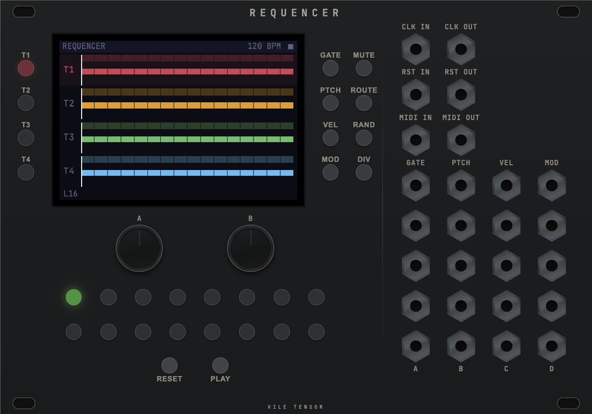

# Requencer

A 4-track eurorack step sequencer built around **polymetric randomization** —
each track has independent gate, pitch, velocity and mod subtracks with their
own lengths and clock dividers, and a randomizer that regenerates a whole
track or a single layer at the press of a button. It replaces a live
setup of four sequencers plus utility modules with one hands-on module.

**[▶ Try it live](https://devboy.github.io/requencer/)** — the browser
preview is the real faceplate layout; everything works with mouse or touch.
See the **[manual](docs/manual.md)** for how to play it.



## ⚡ Help wanted: hardware design review

The firmware, engine, and web preview are working and tested — but I'm a
software developer, not a hardware engineer, and this design is about to go
to manufacturing. **I'd be grateful for experienced eyes on the electronics
before I order boards.**

The module is a three-board stack behind a eurorack faceplate:

- **Control board** — buttons, encoders, jacks, LED drivers, shift
  registers, USB-C, SD card, MIDI in.
- **Main board** — RP2350 (PGA2350), DAC8568 CV outputs with op-amp output
  stages (1V/oct), eurorack power entry and regulators.
- Board-to-board via 2×16 shrouded headers.

**Review materials:**

- 📄 **Schematic review PDFs** (one page per subcircuit, net-label style) and
  the full **KiCad projects, gerbers, and STEP files** are attached to the
  latest [GitHub Release](https://github.com/devboy/requencer/releases).
- The design source is [atopile](https://atopile.io/) (`hardware/boards/elec/src/`),
  compiled to KiCad — the PDFs and KiCad files are what you want to look at
  if you don't read `.ato`.

Particularly unsure about: power entry & regulation, the DAC output stage
(1V/oct scaling/offset accuracy), the board-to-board pinout, and the USB-C /
SD / MIDI input circuits. Issues and PRs welcome.

## Features

- 4 tracks × 4 subtracks (gate / pitch / velocity / mod), each with
  independent step length (1–64) and clock divider — polymetric by default.
- Randomizer with per-track scale, root, range, density and velocity config;
  four gate algorithms (RAND / EUCL / SYNC / CLST); 8 factory presets plus
  user presets.
- Drift (per-subtrack stochastic mutation) and per-track transpose with
  scale quantization.
- Free output routing: any subtrack to any of the 4 output jacks.
- Internal, MIDI, or external clock; per-output MIDI channels.

Full documentation: **[docs/manual.md](docs/manual.md)** (also built into
the web app — the MANUAL button).

## Architecture

| Part | What it is |
|------|------------|
| `crates/engine` | `no_std` pure Rust sequencer logic (runs in WASM and on the RP2350) |
| `crates/renderer` | `no_std` display rendering via embedded-graphics |
| `crates/web` | WASM bindings + Canvas2D target for the browser |
| `crates/firmware` | RP2350 firmware: SPI display, DACs, buttons/encoders |
| `web/` | TypeScript preview: Tone.js audio, Web MIDI, canvas faceplate UI |
| `hardware/` | atopile PCB projects (control + main + faceplate) and the build pipeline |

## Development

```bash
make dev      # Vite dev server (builds WASM first)
make test     # All tests: Rust + web + hardware scripts
make rust     # Test + lint + build firmware
make web      # Test + lint + build web bundle
make hardware # Full hardware pipeline (KiCad + FreeRouting required)
```

## License

- Code: [MIT](LICENSE)
- Hardware design (`hardware/`): [CERN-OHL-S v2](hardware/LICENSE) —
  strongly reciprocal open hardware licence.
