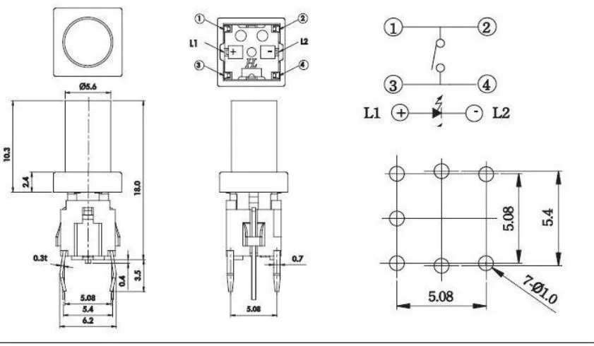
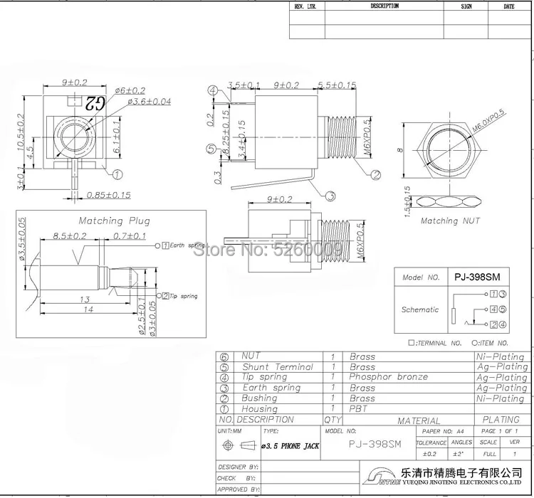
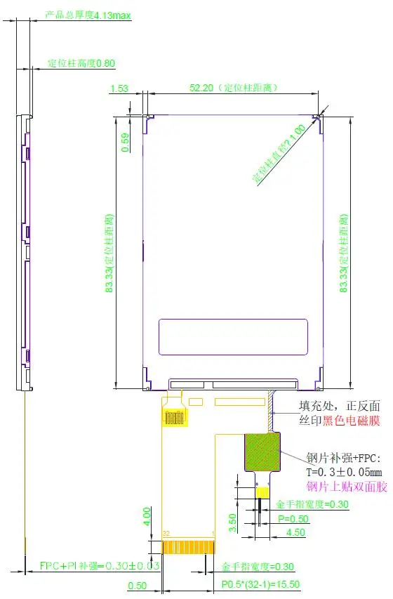
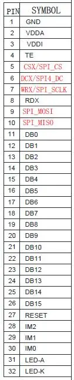
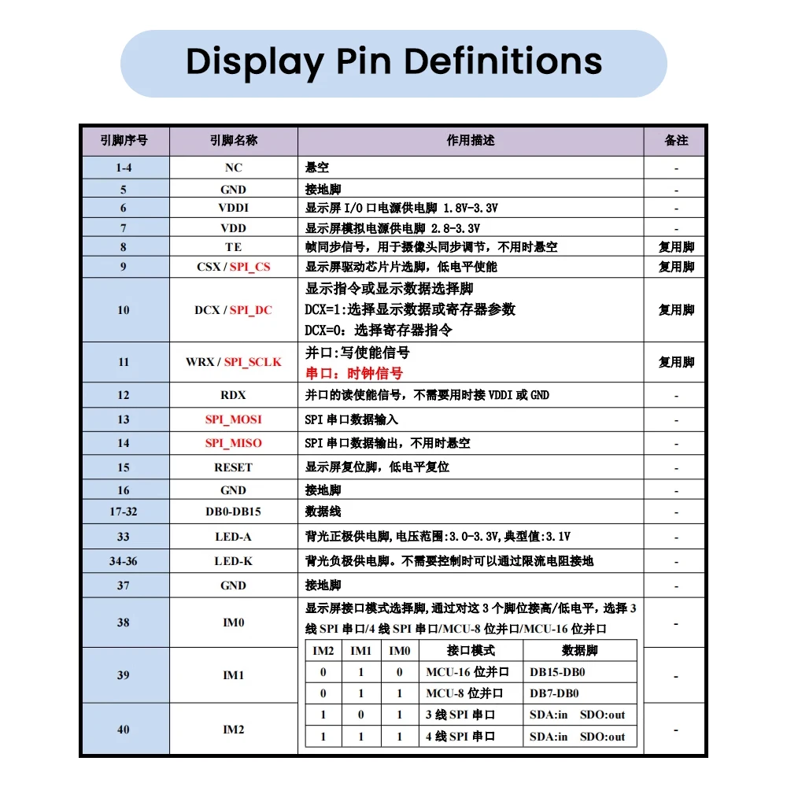

# AliExpress Parts Sourcing

Cost-optimized sourcing for THT components. These parts are hand-soldered and
don't go through JLCPCB assembly, so we can source them from anywhere.

---

## 1. Buttons: TC002-RGB → PB6149L

Replace 36x Well Buying TC002-N11AS1XT-RGB integrated RGB tactile switches (€3.69/ea, €133 total)
with 40x PB6149L single-color white LED tactile switches with translucent caps (€0.61/ea, ~€25 total).

**Savings: ~€108 per board (81%)**

### Current Part: TC002-N11AS1XT-RGB

- **Manufacturer:** Well Buying
- **LCSC:** C5765888
- **Type:** Integrated RGB tactile switch with common-anode RGB LED
- **Pins:** 6 (SW1, SW2, LED_ANODE, LED_RED, LED_GREEN, LED_BLUE)
- **Footprint:** Custom TC002-N11AS1XT-RGB.kicad_mod
- **Cost:** €3.69/ea (Mouser, 100+ tier)
- **Height above PCB:** 8.2mm body + 7.3mm S1 cap = 15.5mm total
- **Protrusion above faceplate:** ~1.9mm (with S1 cap)
- **Quantity used:** 36

#### Current LED Usage

Only 16 step buttons use the LEDs (red + green channels only, blue unused).
The other 20 buttons have LED pins unconnected — paying for unused RGB LEDs.
Each lit button uses 2 TLC5947 channels (red + green) = 32 channels for 16 buttons.

### New Part: PB6149L White LED



- **Type:** 6x6mm illuminated tactile switch with integrated single-color LED and translucent cap
- **Source:** AliExpress (GJW store), 20 sets for €12.29
- **Cost:** €0.61/ea (switch + LED + cap included)
- **LED color:** White (also available: red, green, orange, blue, yellow)
- **Cap options:** Transparent hat (light pipe) or Silver hat (metal)
- **Decision:** Order all 36 with white LED for uniform look. Connect LED pins
  only on buttons that need illumination; leave unconnected on the rest.

#### Mechanical Dimensions (from datasheet)

- **Body:** 6.2 x 5.4mm (standard 6x6mm class)
- **Pin spacing:** 5.08 x 5.08mm (2.54mm grid compatible)
- **Pin count:** 6 through-hole DIP
  - Pins 1, 2: Switch contact A (SPST, internally bridged pair)
  - Pins 3, 4: Switch contact B (SPST, internally bridged pair)
  - Pin L1 (+): LED anode
  - Pin L2 (-): LED cathode
- **Pin hole diameter:** Ø1.0mm (7 holes in footprint per datasheet)
- **Total height above PCB:** ~18mm (with cap)
- **Cap diameter:** Ø5.6mm round
- **Cap height:** 10.3mm

#### Protrusion Calculation

```
Faceplate front surface:     Z =   0.0mm
Faceplate thickness:                1.6mm
Faceplate back surface:      Z =  -1.6mm
Gap (jack housing height):          8.9mm
Control board F.Cu:          Z = -10.5mm  (switch soldered here)

Distance from PCB to faceplate front = 10.5 + 1.6 = 12.1mm
Switch total height above PCB = 18.0mm
Protrusion above faceplate = 18.0 - 12.1 = 5.9mm
```

5.9mm is taller than the TC002's 1.9mm protrusion. The translucent cap can be
trimmed/sanded shorter if desired.

### Pin Mapping: TC002 → PB6149L

| TC002 Pin | Function | PB6149L Pin | Notes |
|-----------|----------|-------------|-------|
| SW1 | Switch contact 1 | Pin 1 or 2 | PB6149L has 2 pins per contact (bridged) |
| SW2 | Switch contact 2 (→ GND) | Pin 3 or 4 | PB6149L has 2 pins per contact (bridged) |
| LED_ANODE | Common anode (+5V) | L1 (+) | Same concept: anode to LED VCC |
| LED_RED | Red cathode (→ TLC5947) | L2 (-) | Single white cathode replaces R/G/B |
| LED_GREEN | Green cathode (→ TLC5947) | — | Not needed (single color) |
| LED_BLUE | Blue cathode (→ TLC5947) | — | Not needed (single color) |

### LED Driver Impact

#### Before (TC002-RGB, bi-color mode)
- 16 step buttons x 2 channels (red + green) = 32 TLC5947 channels used
- 2x TLC5947 (48 channels total), 16 channels spare
- LED supply: 5V common anode, TLC5947 sinks ~19.5mA per channel

#### After (PB6149L, single white LED)
- Up to 36 buttons x 1 channel (white) = 36 TLC5947 channels needed
- 2x TLC5947 (48 channels total), 12 channels spare
- LED supply: same 5V anode, TLC5947 sinks white LED cathode
- **Initially: 17 buttons wired** (16 step + play), remaining 19 unconnected
  - 17 channels used, 31 spare — plenty of room to add more later

#### TLC5947 Channel Assignment (proposed)

**TLC1 (channels 0-23):**

| Channel | Button |
|---------|--------|
| OUT0 | btn_step1 |
| OUT1 | btn_step2 |
| OUT2 | btn_step3 |
| OUT3 | btn_step4 |
| OUT4 | btn_step5 |
| OUT5 | btn_step6 |
| OUT6 | btn_step7 |
| OUT7 | btn_step8 |
| OUT8 | btn_step9 |
| OUT9 | btn_step10 |
| OUT10 | btn_step11 |
| OUT11 | btn_step12 |
| OUT12 | btn_step13 |
| OUT13 | btn_step14 |
| OUT14 | btn_step15 |
| OUT15 | btn_step16 |
| OUT16 | btn_play |
| OUT17-23 | spare (7 channels) |

**TLC2 (channels 0-23):**

| Channel | Button |
|---------|--------|
| OUT0-23 | spare (24 channels, wire more buttons later if desired) |

#### Firmware Impact

The TLC5947 firmware driver currently shifts out 2x 24-bit channel data (one
per TLC). The protocol doesn't change — only the channel mapping. Instead of
2 bits per button (red + green), it becomes 1 bit per button (white).
Simplifies the firmware — fewer channels to update, simpler color model.

### Files to Modify

#### New part definition
- `hardware/boards/parts/PB6149L/PB6149L.ato` — new component
- `hardware/boards/parts/PB6149L/PB6149L.kicad_sym` — KiCad symbol (SPST + LED)
- `hardware/boards/parts/PB6149L/PB6149L.kicad_mod` — KiCad footprint (6-pin THT)

#### Schematic changes
- `hardware/boards/elec/src/button-scan.ato` — replace `TC002_RGB` with `PB6149L`
  - Change all 36 `= new TC002_RGB` to `= new PB6149L`
  - Update pin names: `SW1/SW2` → PB6149L switch pins, `LED_ANODE/LED_RED` → `LED_A/LED_K`
  - Remove references to `LED_GREEN`, `LED_BLUE`
- `hardware/boards/elec/src/control.ato` — rewire LED driver connections
  - Remove per-button RED/GREEN channel wiring
  - Add single cathode wiring: `buttons.btn_stepN.LED_K ~ leds.tlc1.OUTN`
  - Add play button LED wiring
  - Simplify anode wiring (same pattern, just `LED_A` instead of `LED_ANODE`)

#### Configuration updates
- `hardware/boards/component-map.json` — update footprint entry
  - Replace `tc002_rgb` footprint with `pb6149l` dimensions
  - Body: ~6.2x5.4mm (or 7.5x7.5mm with cap base)
  - Drill: faceplate hole ~6mm (for Ø5.6mm cap to pass through)
- `hardware/boards/scripts/procurement/bom_parser.py` — update THT_PARTS set
- `hardware/boards/scripts/procurement/check_parts.py` — update manual pricing
- `hardware/boards/scripts/models/generate_3d_models.py` — new 3D model generator

#### Firmware changes
- `crates/firmware/src/leds.rs` (or equivalent) — update channel mapping
  - 1 channel per button instead of 2
  - Simpler brightness API (single value, not red/green pair)

### Verification Steps

After implementation:
1. `ato build` — verify schematic compiles
2. `make hw-build` — verify KiCad netlist generation
3. `make hw-place` — verify placement with new footprint
4. `make check-parts` — verify BOM classification
5. Visual check: faceplate hole diameter accommodates Ø5.6mm cap
6. Firmware: update LED channel map, test white LED on/off/brightness

---

## 2. Jacks: WQP518MA (Thonkiconn)



Already using WQP518MA — the exact same part is available on AliExpress from
Jingteng (the Qingpu factory that manufactures them). Not a clone, same OEM.

- **Current source:** Thonk (£0.37/ea excl VAT = ~€0.43/ea)
- **AliExpress:** €31.59 for 100pcs = €0.32/ea (Jingteng store)
- **AliExpress link:** https://www.aliexpress.com/item/4000105739424.html
  (search `WQP518MA 3.5mm eurorack 100pcs` if link doesn't work)
- **Quantity needed:** 24 jacks per build
- **No schematic or footprint changes needed** — exact same part

Marginal per-unit savings but convenient to bundle with the button order, and
100 pcs gives plenty of spares. No UK→DE shipping/customs to deal with.

---

## 3. Display: JC3248A035N-1 → Generic ST7796 32-pin bare panel

The current JC3248A035N-1 bare panel (made by Guition / Shenzhen Jingcai Intelligent)
is hard to source in small quantities — MOQ 500 via displaysmodule.com. No retail
listings found on AliExpress, eBay, or Amazon for the bare panel (only the ESP32 dev
boards that use it).

### Current Part: JC3248A035N-1

- **Manufacturer:** Guition (Shenzhen Jingcai Intelligent Co., Ltd.)
- **Type:** Bare ST7796S 3.5" SPI TFT panel (no carrier PCB, no touch)
- **Resolution:** 480×320
- **Interface:** 4-wire SPI (IM pins pre-configured internally)
- **FPC:** 18-pin, 0.5mm pitch
- **Glass:** 85.5 × 54.94 × 2.5mm
- **Active area:** 73.44 × 48.96mm
- **Pinout:** 1=GND, 2=RST, 3=SCK, 4=DC, 5=CS, 6=MOSI, 7=MISO, 8=GND, 9=VCC, 10=LEDA, 11-14=K1-K4, 15-18=NC
- **Sourcing:** MOQ 500 via [displaysmodule.com](https://www.displaysmodule.com/sale-36526887-320x480-spi-lcd-display-st7796-3-5-inch-spi-tft-lcd-tft-lcd-display-screen.html), contact david@guition.com

### New Part: Generic ST7796 32-pin bare panel (maithoga)


- **Source:** [AliExpress listing 32286288684](https://de.aliexpress.com/item/32286288684.html) (maithoga store)
- **Cost:** ~€7.59/ea (qty 1)
- **Controller:** ST7796 (same command set as ST7796S)
- **Resolution:** 320(RGB) × 480
- **Display FPC:** 32-pin, 0.5mm pitch
- **Touch FPC:** 8-pin, 0.5mm pitch (separate connector, GT911 driver)
- **Interface:** 3/4-wire SPI or 8/16-bit parallel (selectable via IM pins)
- **Glass:** 55.26 × 84.52 × 4.13mm (max, including touch variant)
- **Active area:** 48.96 × 73.44mm (identical to JC3248A035N-1)
- **Voltage:** 2.8V–3.3V
- **Current:** 90mA
- **Backlight:** White LED
- **Viewing angle:** 12 o'clock
- **Operating temp:** -20°C to +70°C
- **Variants available:** ST7796 without touch (~€7.59), with capacitive touch (GT911)

#### Dimension Drawings




Key dimensions from drawings:
- Glass outline: 55.26 × 84.52mm
- Active area: 48.96 × 73.44mm
- Display FPC width: P0.5 × (32-1) = 15.5mm
- FPC thickness: 0.30 ± 0.03mm
- Locating post spacing: 52.20mm (horizontal)
- Finger width: 0.30mm, finger gap: 0.20mm

#### Interface Mode Selection (IM pins)


| IM2 | IM1 | IM0 | Mode | Data pins |
|-----|-----|-----|------|-----------|
| 0 | 1 | 0 | 80-16bit parallel | DB15-DB0 |
| 0 | 1 | 1 | 80-8bit parallel | DB7-DB0 |
| 1 | 0 | 1 | 3-line 9bit SPI | SDA:in, SDO:out |
| 1 | 1 | 1 | 4-line 8bit SPI | SDA:in, SDO:out |

For requencer: use 4-wire SPI mode (IM2=1, IM1=1, IM0=1 — all high).

#### Touch Panel FPC (8-pin, separate connector)


| Pin | Signal |
|-----|--------|
| 1 | VDD_3.3V |
| 2 | RST |
| 3 | INT_3.3V |
| 4 | NC |
| 5 | NC |
| 6 | SCL |
| 7 | SDA |
| 8 | GND |

Touch driver: GT911 (I2C). Not needed for requencer — leave unconnected
or omit the touch FPC connector entirely.

#### 32-pin Display FPC Pinout



| Pin | Signal | Function | Requencer wiring |
|-----|--------|----------|-----------------|
| 1 | GND | Ground | GND |
| 2 | VDDA | Analog supply (2.8–3.3V) | 3.3V |
| 3 | VDDI | I/O supply (1.8–3.3V) | 3.3V |
| 4 | TE | Tearing effect sync | NC (float) |
| 5 | CSX / SPI_CS | Chip select (active low) | connector.lcd_cs |
| 6 | DCX / SPI4_DC | Data/command select | connector.lcd_dc |
| 7 | WRX / SPI_SCLK | SPI clock | connector.spi0_sck |
| 8 | RDX | Read strobe (parallel mode) | Tie to 3.3V (deassert) |
| 9 | SPI_MOSI | SPI data in | connector.spi0_mosi |
| 10 | SPI_MISO | SPI data out | connector.spi0_miso |
| 11 | DB0 | Data bus bit 0 | NC (float) |
| 12 | DB1 | Data bus bit 1 | NC (float) |
| 13 | DB2 | Data bus bit 2 | NC (float) |
| 14 | DB3 | Data bus bit 3 | NC (float) |
| 15 | DB4 | Data bus bit 4 | NC (float) |
| 16 | DB5 | Data bus bit 5 | NC (float) |
| 17 | DB6 | Data bus bit 6 | NC (float) |
| 18 | DB7 | Data bus bit 7 | NC (float) |
| 19 | DB8 | Data bus bit 8 | NC (float) |
| 20 | DB9 | Data bus bit 9 | NC (float) |
| 21 | DB10 | Data bus bit 10 | NC (float) |
| 22 | DB11 | Data bus bit 11 | NC (float) |
| 23 | DB12 | Data bus bit 12 | NC (float) |
| 24 | DB13 | Data bus bit 13 | NC (float) |
| 25 | DB14 | Data bus bit 14 | NC (float) |
| 26 | DB15 | Data bus bit 15 | NC (float) |
| 27 | RESET | Reset (active low) | RC reset circuit |
| 28 | IM2 | Interface mode bit 2 | Tie to 3.3V (high) |
| 29 | IM1 | Interface mode bit 1 | Tie to 3.3V (high) |
| 30 | IM0 | Interface mode bit 0 | Tie to 3.3V (high) |
| 31 | LED-A | Backlight anode | 3.3V via current-limit resistor |
| 32 | LED-K | Backlight cathode | MOSFET drain (PWM) |

Notes:
- IM2=1, IM1=1, IM0=1 selects 4-wire SPI mode
- DB0-DB15 unused in SPI mode, can float per ST7796 datasheet
- Only 1 LED-K cathode (vs 4 on JC3248A035N-1) — simplifies backlight circuit
- VDDA and VDDI are separate supplies (both 3.3V for requencer)

#### 40-pin ST7796 Reference Pinout

For reference, a 40-pin ST7796 panel from a different AliExpress listing shows
the same signal set with 4 extra NC pins and 3 LED-K cathodes:



### Comparison

| | JC3248A035N-1 (current) | 32-pin bare panel (new) |
|---|---|---|
| Controller | ST7796S | ST7796 |
| Resolution | 480×320 | 480×320 |
| Active area | 73.44 × 48.96mm | 73.44 × 48.96mm |
| Glass size | 85.5 × 54.94mm | 55.26 × 84.52mm |
| Thickness | 2.5mm | 4.13mm max |
| FPC pins | 18 | 32 |
| FPC pitch | 0.5mm | 0.5mm |
| FPC width | ~9mm | 15.5mm |
| IM pins | Pre-wired (SPI only) | Exposed (need pull-ups) |
| Parallel bus | Not exposed | DB0-DB15 exposed |
| Touch | No | Optional (separate 8-pin FPC) |
| Sourcing | MOQ 500, wholesale only | Retail, qty 1 on AliExpress |
| Price | ~¥50 CNY (~€7) @ MOQ 500 | ~€7.59 qty 1 |

### Impact Assessment

**No firmware changes** — same ST7796 command set, same SPI protocol, same resolution.

**No main board changes** — display SPI signals through board connector stay identical.

**Control board changes needed:**
1. **FPC connector** — swap `FPC_18P_05MM` → `FPC_32P_05MM` (JUSHUO AFC01-S32FCA-00, LCSC C262672, same AFC01 family as existing 18-pin)
2. **Pin remapping** — SPI signals move: CS→pin5, DC→pin6, SCK→pin7, MOSI→pin9, MISO→pin10, RST→pin27
3. **IM pins** — tie pin28 (IM2), pin29 (IM1), pin30 (IM0) to 3.3V for 4-wire SPI mode
4. **Power** — wire pin2 (VDDA) and pin3 (VDDI) both to 3.3V (18-pin panel only had one VCC)
5. **Backlight** — single LED-K (pin32) instead of 4 cathodes — simplifies MOSFET wiring
6. **Unused pins** — DB0-DB15 (pins 11-26), TE (pin4), RDX (pin8) can float

**Faceplate changes:**
- Glass is ~1mm shorter (84.52 vs 85.5mm height) and ~0.3mm wider (55.26 vs 54.94mm)
- Active area identical — image position unchanged
- Thickness 4.13mm vs 2.5mm — panel can stick out or be glued to faceplate

### Files to Modify

- `hardware/boards/parts/FPC_32P_05MM/` — new FPC connector part (find on JLCPCB)
- `hardware/boards/elec/src/control.ato` — swap connector, remap pins, add IM pull-ups
- `hardware/boards/elec/src/display.ato` — update documentation/specs
- `hardware/boards/component-map.json` — update display dimensions if needed
- `hardware/boards/board-config.json` — update FPC connector placement if needed

---

## Order Summary

| # | Item | Qty | Source | Est. Price | Status |
|---|------|-----|--------|------------|--------|
| 1 | PB6149L White LED + transparent cap | 100 pcs (5x 20-pack) | AliExpress (GJW) | ~€61.45 | Ordered |
| 2 | WQP518MA 3.5mm mono jack + silver nut | 100 pcs | AliExpress (Jingteng) | €31.59 | Ordered |
| 3 | ST7796 3.5" 32-pin bare panel (no touch) | 2 pcs | AliExpress (maithoga) | ~€15.18 | Ordered |
| | | | | | |
| | **Total** | | | **~€108** | All ordered |
