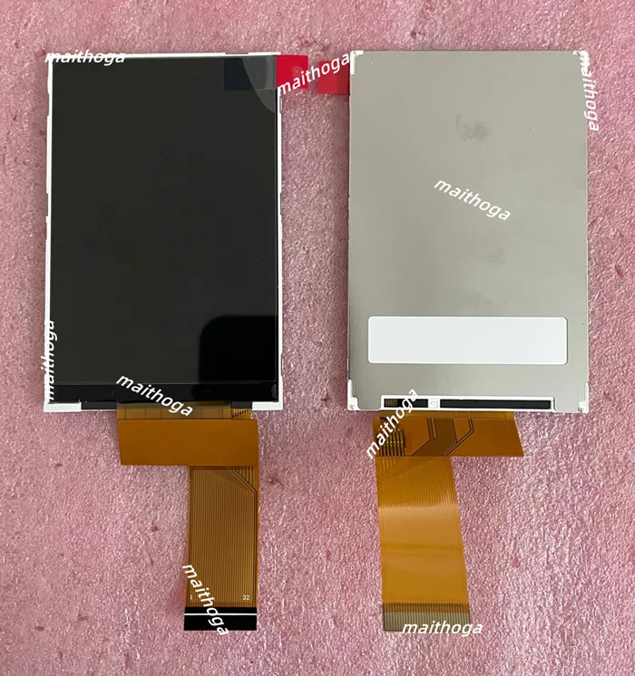
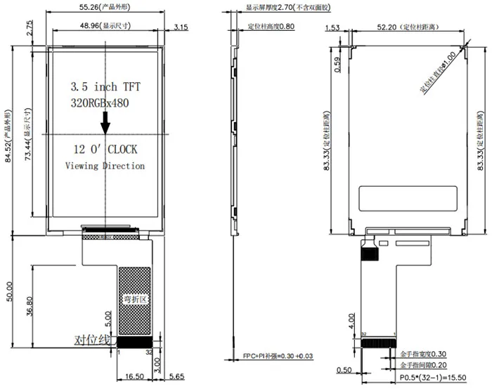
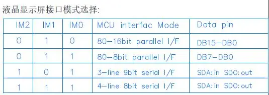
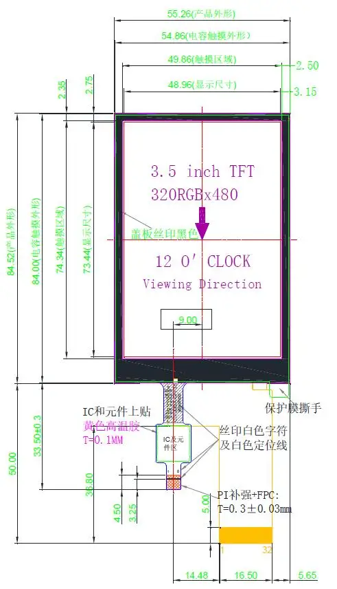
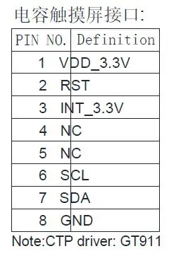

# Display

**Source:** [`display.ato`](./display.ato)
**Board:** N/A (documentation only -- all circuits live in [`control.ato`](../../boards/control/control.ato))

## Purpose

This file documents the display specifications and FPC pinout. It contains no physical parts or circuit definitions. All display-related circuits (FPC connector, backlight MOSFET, reset RC, IM pull-ups, bypass caps) are instantiated directly in `control.ato` on the control board.

## Photos





## Display Specifications

| Parameter | Value |
|-----------|-------|
| Controller | ST7796 |
| Size | 3.5" diagonal |
| Resolution | 480 x 320 pixels |
| Glass dimensions | 55.26 x 84.52 mm (portrait); mounted landscape |
| Active area | 73.44 x 48.96 mm |
| Thickness | 4.13 mm max |
| Interface | 4-wire SPI (IM2=IM1=IM0=1 via 10k pull-ups) |
| FPC | 32-pin, 0.5mm pitch, exits right edge (landscape orientation) |
| FPC Connector | JUSHUO AFC01-S32FCA-00 (LCSC C262672) |
| Backlight | Single LED, anode to 5V via 82 ohm (~18mA), cathode switched by 2N7002 MOSFET |
| Source | Generic ST7796 bare panel (maithoga, AliExpress) |

## FPC Pinout


| Pin | Signal | Connection |
|-----|--------|------------|
| 1 | GND | Ground |
| 2 | VDDA | 3.3V (analog supply) |
| 3 | VDDI | 3.3V (I/O supply) |
| 4 | TE | Tearing effect -- not connected |
| 5 | CS | LCD chip select (from MCU GP1) |
| 6 | DC | Data/command select (from MCU GP7) |
| 7 | SCK | SPI clock (from MCU GP2) |
| 8 | RDX | Read strobe -- tied to 3.3V (deasserted) |
| 9 | MOSI | SPI data in (from MCU GP3) |
| 10 | MISO | SPI data out (to MCU GP0) |
| 11-26 | DB0-DB15 | Parallel data bus -- unused in SPI mode, floating |
| 27 | RESET | Active-low reset (RC power-on + GPIO control) |
| 28 | IM2 | Interface mode bit 2 -- 10k pull-up to 3.3V |
| 29 | IM1 | Interface mode bit 1 -- 10k pull-up to 3.3V |
| 30 | IM0 | Interface mode bit 0 -- 10k pull-up to 3.3V |
| 31 | LED-A | Backlight anode (5V via 82 ohm) |
| 32 | LED-K | Backlight cathode (switched by 2N7002 MOSFET) |

## Signal Path

```
MCU (main board) --[SPI0 + control]--> Board Connector ---> Control Board ---> FPC Connector ---> Display Glass
     GP1 (CS)                              Header A pin 12
     GP2 (SCK)                             Header A pin 10
     GP3 (MOSI)                            Header A pin 9
     GP0 (MISO)                            Header A pin 11
     GP7 (DC)                              Header A pin 13
     GP5 (BL PWM)                          Header A pin 14
     GP22 (RST)                            Header B pin 7
```

## Circuits on Control Board

The following display support circuits are defined in `control.ato`:

- **FPC connector** (FPC_32P_05MM): Physical 32-pin 0.5mm FPC connector
- **Reset RC** (10k + 100nF, tau=1ms): Ensures reset is asserted at power-on before MCU boots; GPIO can pull low for runtime reset
- **IM pull-ups** (3x 10k to 3.3V): Configure IM2/IM1/IM0 all high for 4-wire SPI mode
- **Backlight driver** (2N7002 N-MOSFET + 100 ohm gate + 100k gate pull-down): PWM dimming via LCD_BL signal; 82 ohm current limit gives ~18mA (conservative for eurorack viewing distance)
- **Bypass caps** (2x 100nF): One each for VDDA and VDDI supply domains

## Interface Mode Selection



IM2=IM1=IM0=1 (all high via 10k pull-ups) selects 4-wire SPI mode.

## Additional Reference Images

| Image | Description |
|-------|-------------|
|  | Back of panel showing FPC |
|  | Dimensions including touch overlay variant |
|  | 8-pin touch FPC (GT911 I2C, not used) |
|  | 40-pin variant pinout for reference |
